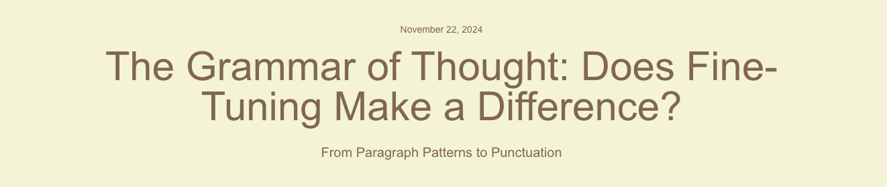

<p align="center">
  
</p>

This repository contains all the resources, tools, and scripts from my [blog post about exploring literary styles](https://peytoncasper.com/blog/tone-evaluation/index.html) through stylometry and fine-tuning language models. If you're interested in analyzing writing style, training models to mimic authors, or breaking down storytelling structures, this is for you.

---

## **What's in This Repo?**

### **Stylometry Tools**
Scripts to analyze word length, punctuation, and word frequency to identify writing patterns.

### **Fine-Tuning Pipeline**
Scripts to prepare datasets and evaluate how fine-tuning affects language model outputs.

### **Narrative Element Analysis**
Tools to classify paragraphs into categories like action, dialogue, and description.

### **Sample Data and Outputs**
Pre-processed datasets and generated outputs for experimentation.

> **Note:** Due to copyright restrictions, this repository includes only minimal sample data for demonstration purposes. You can easily add your own text data to the `data/sample_texts/` directory to analyze your preferred authors or works.

### **Visualizations**
Scripts to generate heatmaps, radar charts, and sliders to visualize differences in style and model performance.

---

## **Getting Started**

### **Step 1: Clone the Repository**
```bash
git clone https://github.com/your-repo/the-grammar-of-thought.git
cd the-grammar-of-thought
```

### **Step 2: Install Dependencies**
Make sure you have Python 3.8+ installed, then run:

```bash
pip install -r requirements.txt
```

### **Step 3: API Keys**
You'll need access to:
- OpenAI API (or Azure OpenAI Studio) for fine-tuning and generating outputs.
- Gemini API for paragraph classification. (Sign up for a key here).

Add your API keys to the environment using:

```bash
export AZURE_OPENAI_ENDPOINT="https://fine-tuning.openai.azure.com/openai/deployments/gpt-35-turbo/chat/completions?api-version=2024-08-01-preview"
export AZURE_OPENAI_API_KEY="**************"
export GOOGLE_APPLICATION_CREDENTIALS="gemini.json"
```

## **What You Can Do**

### **1. Stylometry Analysis**
Run scripts to analyze basic features of writing style:
- Word Length Distribution
- Punctuation Usage
- Word Frequency

To analyze punctuation patterns:
```bash
python scripts/punctuation_analysis.py
```

Example output:
```yaml
Author: J.K. Rowling
Periods: 32%
Commas: 27%
Quotation Marks: 15%
...
```

### **2. Fine-Tuning a Model**
Prepare datasets for fine-tuning and analyze the results:

Use scripts/fine_tuning_preparation.py to generate paragraph-summary pairs from your texts.
Fine-tune the model using Azure OpenAI Studio or OpenAI's API.
Example usage:

```bash
python scripts/fine_tuning_preparation.py --input data/sample_texts/jk_rowling_sample.txt --output data/fine_tuning/fine_tuning_dataset.json
```

Once fine-tuned, you can test outputs and compare them to the original text using the classification scripts.

⚠️ Note: Fine-tuning works best with datasets of 600–800 samples. Using too much data can lead to overfitting.

### **3. Narrative Element Classification**
Classify paragraphs into narrative elements like dialogue, action, or description:

```bash
python scripts/classify_paragraphs.py --input data/sample_texts/jk_rowling_sample.txt
```

The output will include a breakdown of narrative elements for each paragraph.

### **4. Visualize the Results**
Generate visualizations to compare styles:

Heatmaps for word frequency similarity:
```bash
python scripts/generate_jensen_shannon_heatmap.py
```

Radar charts for narrative element balance:
```bash
python scripts/visualize_radar_chart.py
```

For interactive visualizations (e.g., fine-tuning evolution sliders), use:

```bash
streamlit run visualizations/interactive_slider_demo/app.py
```

## **FAQ**

### **What APIs do I need?**
You’ll need:
- OpenAI or Azure OpenAI API for fine-tuning and generating outputs.
- Gemini API for narrative element classification.

### **Can I use my own texts?**
Yes. Replace the sample texts in data/sample_texts/ with your own, then use the scripts to analyze or fine-tune based on those texts.

### **What if I can't fine-tune?**
If you don’t have API access, you can still explore the stylometry scripts and pre-generated outputs in the data/ folder.

## **How This Works**

### **Stylometry**
Analyze:
- Word Lengths: Measure the frequency of short vs. long words.
- Punctuation: Compare styles by punctuation usage.
- Word Frequency: Quantify how similar texts are based on word usage.

### **Fine-Tuning**
Use GPT models to mimic an author’s style by training on paragraph-summary pairs. Generate datasets using fine_tuning_preparation.py and compare outputs.

### **Narrative Elements**
Classify paragraphs into categories like:
- Dialogue
- Action
- Description
- Exposition
- Inner Thoughts

## **Next Steps**
Run the Scripts
Start with the stylometry analysis scripts in scripts/.

Use Your Own Data
Replace the sample texts in data/sample_texts/ to analyze or fine-tune based on your own sources.

Visualize Your Results
Use the visualization scripts to create heatmaps, radar charts, or interactive demos.

## **Contribute**
If you have ideas for improving this project or find a bug, open an issue or submit a pull request.

## **Contact**
If you have questions or want to share your results, feel free to reach out. I’d love to hear how you’re using this project!